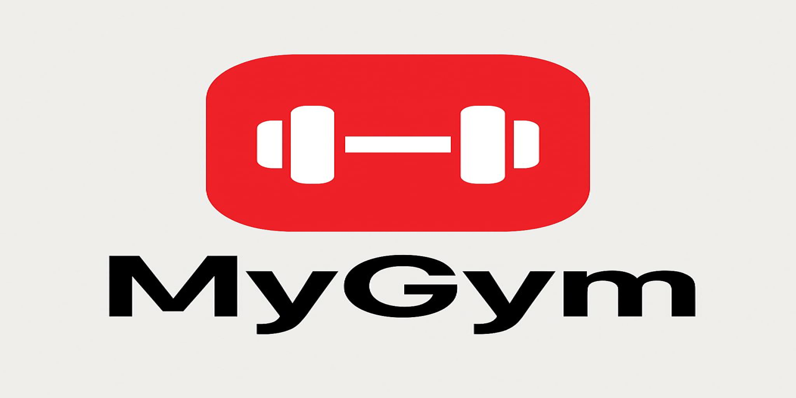

<p align="center">
  
</p>

MyGym
Benvenuto in **MyGym**, un progetto dedicato alla gestione di palestre e programmi di allenamento.

Descrizione
MyGym è un software pensato per aiutare utenti e trainer a monitorare gli allenamenti, creare schede personalizzate e tenere traccia dei progressi nel tempo.

Funzionalità principali
- Registrazione utenti e gestione profili
- Creazione di piani di allenamento personalizzati
- Monitoraggio dei progressi con grafici e statistiche
- Archivio esercizi e gestione attrezzi

Installazione
1. Clona la repository:
   ```bash
   https://github.com/lele845/MyGymSoftware.git
Questo progetto è stato realizzato dal team di **MyGym**:
-Raffaele Cirillo [] [
